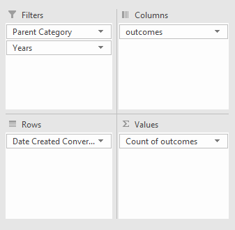
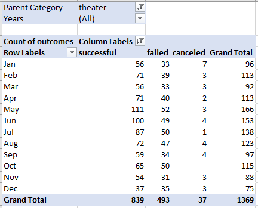
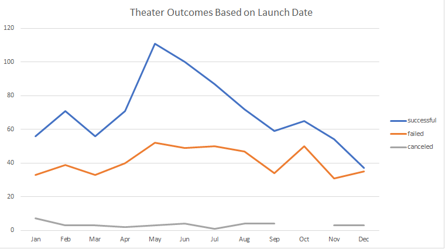
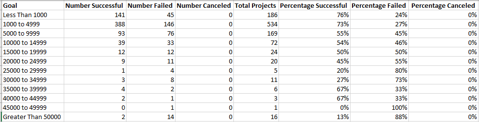
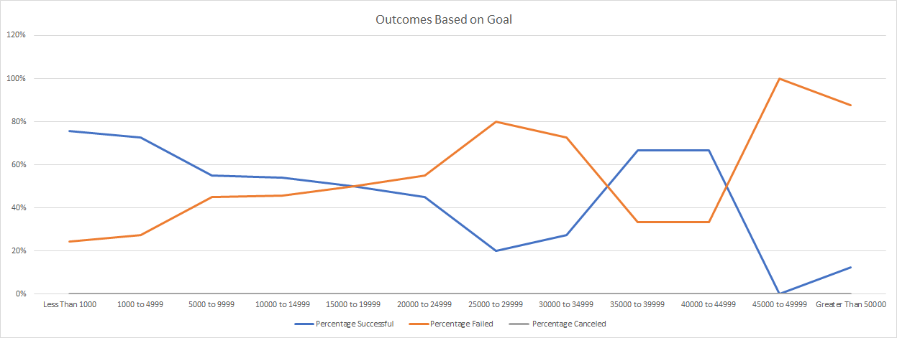

# Kickstarting with Excel

## Overview of Project

### This analysis was designed to assist Louise in understanding trends of Kickstarter campaign outcomes based on the time of year a campaign is launched and the funding goal amount requested. By visualizing launch dates and funding goals for successful, failed, and canceled theater- and play-related campaigns, Louise can easily see the time of year and goal amounts associated with the greatest number of successful campaigns. She can use this correlation to plan for future campaigns.   

## Analysis and Challenges

### Analysis of Outcomes Based on Launch Date
_**New Column for Launch Year**_

To visualize the campaign outcomes (successes, failures, and cancellations) in relation to the date the campaigns were launched, I first created a **Years** column (U) in the Kickstarter data Excel sheet. To do this, I utilized the `=YEAR()` function with input from the **Date Created Conversion** column (S). Filling in the rest of the **Years** column gave me the launch year for each Kickstarter campaign.

_**Building the Pivot Table**_

Next, I utilized all of the data within the Kickstarter worksheet in a pivot table. I set the **Parent Category** and **Years** as filters, **Outcomes** as the columns, **Date Created Conversion** as the rows, and **Count of Outcomes** for the values to be displayed. When the **Date Created Conversion** field is added to the Rows area, the chart provides options for years, quarters, and month displays, but I removed the Years and Quarters options to simplify the display by month. The Years filter provides the option to adjust the display for a specific year's results if desired.

  

As Louise wanted to know specifically about theater campaigns, I filter the **Parent Category** to only show theater. Then I adjusted the Column Labels filter to:

1. Uncheck _Live_ from outcomes options so we only view completed campaigns
2. Select 'More Sort Options...' and sort the outcomes in descending order

This resulted in a table displaying the number of successful, failed, and canceled theater campaigns by month launched and the total number of each outcome overall.

_**Visualizing in a Pivot Chart**_

With the pivot table built and filtered as desired, I used the table to create a pivot chart by selecting _PivotTable Analyze_ in Excel, selecting _PivotChart_, and selecting a Line Chart. I chose Line as it clearly displays the change of outcomes over time and we will be able to see correlate certain months with success or failure. To make the chart presentable, I selected _Hide All Field Buttons on Chart_ and added the chart title: **Theater Outcomes Based on Launch Date**.
	

      
### Analysis of Outcomes Based on Goals
_**COUNTIFS() Data Compilation**_

To visualize how funding goal amounts can compare to the success of a campaign, I began by creating a new worksheet to compile the number of successful, failed, and canceled play campaigns with rows of goal amounts in set increments. To pull this specific data from the Kickstarter worksheet, I used the `COUNTIFS()` function with criteria ranges related to _outcome_, _goal_, and _subcategory_. Since Louise only wants to see campaigns for plays, the _subcategory_ was always set as **plays**, however the _outcome_ varied per column depending on if I was compiling data on **successful**, **failed**, or **canceled** campaigns. Additionally, the function varied per cell based on the defined _goal_ criteria.

For example, the following function provided the number of **successful** Kickstarter **play** campaigns with funding goals of **less than $1,000**: 
`=COUNTIFS(Kickstarter!$F:$F,"successful", Kickstarter!$D:$D, "<1000", Kickstarter!$R:$R, "plays")` 

This function's criteria changes when looking at the number of **failed play** campaigns that had funding goals **between $25,000 and $29,999**:
`=COUNTIFS(Kickstarter!$F:$F,"failed", Kickstarter!$D:$D, ">=25000", Kickstarter!$D:$D, "<=29999", Kickstarter!$R:$R, "plays")`

_**SUM And Percentage**_

Once the number of the play campaigns by outcome and goal amount had been compiled, I created a new column titled _Total Projects_ and used the `SUM()` function to calculate the total number of play campaigns for each goal range. For example, `=SUM(B2, C2, D2)` added the listed cell values for the number of **successful**, **failed**, and **canceled** plays that had a goal of **<$1,000**. Dragging this function down the worksheet automatically counted the total projects for each goal range. 

Next, to calculate the percentage of successful, failed, and canceled play campaigns, I created three additional columns for each outcome percentage and utilized a formula to divide the _Number (Outcome)_ column by the _Total Projects_ column. For example, `=B2/E2` divides the number of **Successful** plays with goals less than $1,000 by the the **Total** number of plays with the same goal range. This gave me a general number, so I formatted the cell to display as a percentage with 0 decimal places. I dragged this formula down to fill out the rest of the column and then applied the same analysis for the failed and canceled percentage columns.

_**Visualizing Campaign Outcome Percentages by Goal**_

To visualize this percentage data, I selected the Goal column and the three percentage columns and then selected **Insert Line Chart**. For presentation, I adjust the chart's size to make it bigger and added the chart title: **Outcomes Based on Goal**.

### Challenges and Difficulties Encountered
There are several challenges that can be associated with these analyses. 

For _Theater Outcomes Based on Launch Date_, knowing which fields should be utilized for which pivot table areas can be a challenge. Through trial and error, as well as critical thinking, I was able to find which fields belonged in which area. An additional challenge can be adjusting the dates in the rows to display by month and not by year. 

For the _Outcomes based on Goal_ analysis, knowing how to use the `COUNTIFS()` function appropriately, specifically which criteria are necessary to get the counts desired was a challenge. By watching a video of an example of the function, I was able to apply its rules to my worksheet.

Additionally, through trial and error I learned that only the Goal and the three Percentage columns needed to be highlighted to create the line graph, not the entire worksheet.
 
## Results

- What are two conclusions you can draw about the Outcomes based on Launch Date?

Late Spring/early Summer (May/June) is an ideal time to launch a theater-based Kickstarter campaign as this time has the highest number of theater campaigns, two-thirds of the which have successful outcomes. Winter is a poor time to launch a theater campaign as the total number of theater campaigns is low and the success of campaigns steadily declines to nearly a 50% success rate in December.

- What can you conclude about the Outcomes based on Goals?

A large majority of play-based Kickstarter campaigns have funding goals listed under $10,000. Campaigns under $5,000 are likely to be funded (~75% success rate), while campaigns over $15,000 have a higher likelihood of failure. The success of higher-goal campaigns is possible (67% success for $35,000-45,000 goals), but the small sample size limits the interpretation. Ideally, aim for a campaign with a funding goal less than $10,000 (less than $5,000, if possible) to have the highest likelihood of success.

- What are some limitations of this dataset?

Some limitations of this dataset include any reasoning why a campaign is canceled or fails (did another part of the project fall through?), the potential limitations in advertising for a campaign (how many shares did one campaign receive on social media compared to another?), and a wide variance in geographic location for a campaign (the United States is a huge country, funding for a project in New York City will be very different from funding in Slocomb, Alabama). 

- What are some other possible tables and/or graphs that we could create?

An additional table covering the comparison of play-related campaign outcomes based on the the campaign being _Staff Picked_ or in the _Spotlight_ could help Louise determine if it being highlighted in someway is actually beneficial to a campaign's success.

Another table demonstrating the outcome of campaigns based on their run time length (launch date to deadline) could help Louise determine the ideal length of time to give a campaign to reach success. 